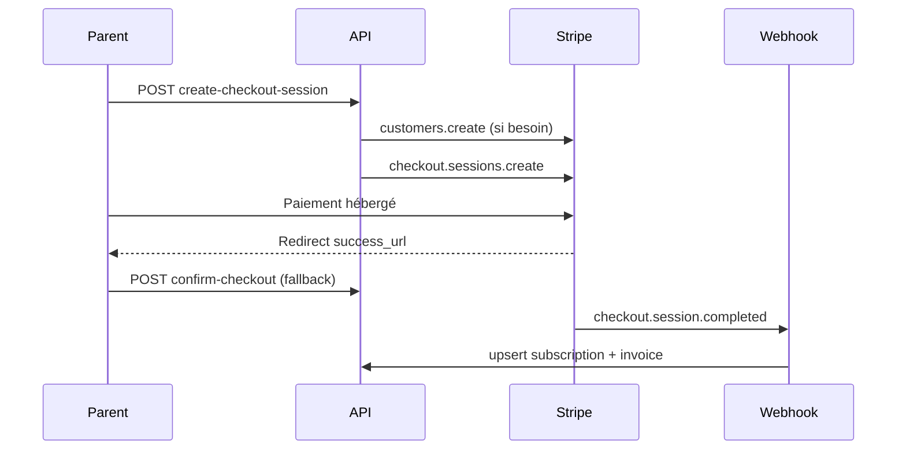

# Stripe Production — HKids

## Objectif

Passer d'un flux Checkout « démo » (confirmation côté client uniquement) à une intégration Stripe **production** avec webhooks signés, cycle de vie complet des abonnements, factures, historique et essai gratuit.

## Architecture

```mermaid
flowchart LR
  parent[Compte parent] -->|Checkout / Cancel / Portal| api[Routes subscriptions]
  stripe[Stripe API] -->|webhooks signés| webhook[/api/webhooks/stripe]
  webhook --> webhookService[stripeWebhookService]
  api --> subscriptionService[subscriptionService]
  webhookService --> subscriptionService
  subscriptionService --> db[(PostgreSQL)]
```

### Couches

| Fichier | Rôle |
| --- | --- |
| `backend/services/stripe/stripeConfig.js` | Client Stripe, URL frontend, secrets webhook |
| `backend/services/stripe/subscriptionService.js` | Checkout, essai, cancel, renew sync, factures, historique |
| `backend/services/stripe/stripeWebhookService.js` | Vérification signature + dispatch événements |
| `backend/routes/subscriptions.js` | Auth, validation, JSON uniquement |
| `backend/routes/stripeWebhooks.js` | Body brut + signature (avant `express.json`) |

## Variables d'environnement

```env
STRIPE_SECRET_KEY=sk_live_...
STRIPE_WEBHOOK_SECRET=whsec_...
STRIPE_CHECKOUT_TRIAL_DAYS=0
FRONTEND_URL=https://hkids.vercel.app
```

- `STRIPE_WEBHOOK_SECRET` est **obligatoire** en `NODE_ENV=production`.
- `STRIPE_CHECKOUT_TRIAL_DAYS` ajoute un essai Stripe optionnel sur le premier abonnement payant (distinct de l'essai applicatif 7 jours).

## Endpoints API

### Public / catalogue

| Méthode | Route | Description |
| --- | --- | --- |
| `GET` | `/api/subscriptions/plans` | Plans actifs (hors essai interne) |

### Authentifié parent

| Méthode | Route | Description |
| --- | --- | --- |
| `GET` | `/api/subscriptions/me` | Abonnement courant + déblocages |
| `GET` | `/api/subscriptions/invoices?limit=20&offset=0` | Factures paginées |
| `GET` | `/api/subscriptions/history?limit=50&offset=0` | Historique événements |
| `POST` | `/api/subscriptions/create-checkout-session` | Checkout Stripe (customer réutilisé) |
| `POST` | `/api/subscriptions/confirm-checkout` | Fallback client après redirect |
| `POST` | `/api/subscriptions/start-trial` | Essai gratuit 7 jours (app, sans CB) |
| `POST` | `/api/subscriptions/cancel` | Annulation fin de période (défaut) ou immédiate |
| `POST` | `/api/subscriptions/resume` | Annule une annulation programmée |
| `POST` | `/api/subscriptions/billing-portal` | Portail client Stripe |
| `POST` | `/api/subscriptions/unlock-book` | Déblocage livre premium |

### Webhook (Stripe → serveur)

| Méthode | Route | Sécurité |
| --- | --- | --- |
| `POST` | `/api/webhooks/stripe` | Body brut + header `Stripe-Signature` |

## Événements webhook gérés

| Événement | Action |
| --- | --- |
| `checkout.session.completed` | Active l'abonnement + facture initiale |
| `customer.subscription.created` | Synchronise statut / périodes |
| `customer.subscription.updated` | Renouvellement, `cancel_at_period_end`, `past_due` |
| `customer.subscription.deleted` | Passe en `canceled` |
| `invoice.paid` | Enregistre facture + renouvelle période |
| `invoice.payment_failed` | Met à jour statut `past_due` / `unpaid` |
| `invoice.finalized` | Enregistre facture brouillon/finalisée |

Idempotence : table `stripe_webhook_events` (clé = `stripe_event_id`).

## Schéma SQL ajouté

### Colonnes

- `users.stripe_customer_id`
- `subscription_plans.stripe_price_id`, `trial_days`
- `user_subscriptions.trial_end`

### Tables

- `subscription_invoices` — factures Stripe (URL PDF, montants, périodes)
- `subscription_events` — journal métier (cancel, renew, trial, etc.)
- `stripe_webhook_events` — idempotence webhook

## Sécurité

1. **Signature webhook** via `stripe.webhooks.constructEvent`.
2. **Route webhook montée avant `express.json`** pour conserver le body brut.
3. **Secret webhook requis en production** (`requireWebhookSecretInProduction`).
4. **`POST /subscribe` (manuel) bloqué en production**.
5. **Paiements réservés aux comptes parent** (`rejectKidPayment`).
6. **Vérification propriétaire** sur `confirm-checkout` (`client_reference_id` / metadata).

## Flux Checkout



Le webhook est la source de vérité. `confirm-checkout` reste pour compatibilité immédiate après redirect.

## Essai gratuit

Deux mécanismes :

1. **Essai applicatif** (`POST /start-trial`) : 7 jours, 3 livres, sans Stripe.
2. **Essai Stripe optionnel** : `STRIPE_CHECKOUT_TRIAL_DAYS` ou `subscription_plans.trial_days`.

## Tests

```bash
cd backend
npm install
npm test
```

Couverture unitaire (`backend/tests/stripe.test.js`) :

- mapping des statuts Stripe ;
- rejet signature manquante / invalide ;
- acceptation signature valide (header de test Stripe) ;
- blocage abonnement manuel en production.

## Configuration Stripe Dashboard

1. Activer **Customer Portal** (annulation, factures, moyens de paiement).
2. Créer endpoint webhook : `https://<backend>/api/webhooks/stripe`.
3. Sélectionner les événements listés ci-dessus.
4. (Recommandé) Créer des **Price IDs** live et les renseigner dans `subscription_plans.stripe_price_id`.

## Compatibilité

- URLs et réponses existantes conservées (`/plans`, `/me`, `/create-checkout-session`, `/confirm-checkout`, `/start-trial`, `/unlock-book`).
- Les comptes enfant héritent toujours de l'abonnement parent via `getBillingUserId`.
